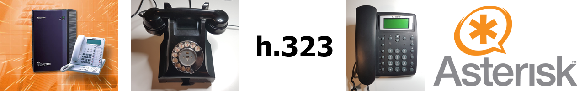

# Interfacing the Panasonic KX-TDA30 to Asterisk, with h.323

How To guide for interfacing Asterisk VoIP server to Panasonic KX-TDA30 with KX-TDA3480 IPGW4 card.

It is likely to also work with TDA100, TDA200 and TDA600 (although the card model numbers will differ) - the system programming software is almost identical.  You may have issues with KX-TDE or NCP systems if the H.323 license key has been lost, or never installed.

## Abstract

This configuration guide is a "How To" for those wishing to connect an Asterisk VoIP server to the Panasonic KX-TDA30 PABX, using the IPGW4 (KX-TDA3480) h.323 expansion card.

This project is targeted at an audience interested in maintaining heritage telecoms equipment, much of which is many decades old.  If you are looking for a commercial set-up, you are in the wrong place.

### Motivation

With the PSTN transition to modern VoIP services already happening (for more information see [Openreach Stop Sell List](https://www.openreach.co.uk/cpportal/products/product-withdrawal/stop-sells-updates)), concerns are being raised by a number of people operating "Heritage Telecoms" equipment, which depends upon Loop Disconnect dialling.  The configuration described here, allows a number of LD telephones to be seamlessly connected to modern VoIP services, and retain access to the PSTN.  Additionally, they may join an existing Asterisk VoIP setup, which already has other VoIP extensions.

The KX-TDA30 permits expansion cards which support analogue telephones to be fitted.  In addition, there are four built in hybrid ports, which simultaneously support both analogue and digital proprietary telephones.

By not using VoIP extensions, we avoid the need to provide additional power at every extension.

The card required to interface the TDA30 to Asterisk, by h.323 is the "IPGW4" (KX-TDA3480).

The cards required for the TDA30 to support analogue terminal equipment are of the "SLC4" and/or the "SLC8" type.  Their line characteristics correspond closely with the existing POTS PSTN (at the time of writing).  These cards support both LD and DTMF dialling.

If you optionally wish to use the PSTN or SIP-ATA adaptors, you will also need a "LCOT4" card.  We shall not describe SIP ATA configuration here.

### Comparison of using h.323 instead of a SIP ATA

- #### Advantages
  The IPGW4 card is configured in the TDA30 as a "Private Circuit" or "TIE line".  This allows seamless extension to extension dialling between VoIP and analogue extensions, in addition to providing access to the PSTN via the Asterisk server.  Trying to set up a similar configuration with SIP ATAs is awkward and the author has found it to be unreliable too.  Additionally, because the TDA30 employs a digital backplane, once the ADC conversion is done in the SLC card, it stays in the digital domain, right up until the destination exchange serving the callee, be it local, or across the globe.

  Using SIP ATAs with a LCOT card requires three conversions to that point, instead of one.  Additionally, to direct an incoming call to an arbitrary extension, presents its own problems.  There are also dozens of settings in each ATA.  If you use ATAs, you may find that you have to adjust gain settings, by trial and error.  Each SIP ATA would require an individual power supply, network switch port and connection to a LCOT card.  Avoiding ATAs eliminates much cabling.

  The IPGW4, in this configuration can also handle multiple SIP accounts (via Asterisk) and send them to individual DIL destinations (extensions or ICD groups), or emulate ISDN MSN destinations.  It is capable of handling four simultaneous calls.  It can also route out via multiple SIP accounts.

- #### Disadvantages

  Using SIP, RTP packets may be routed separately from the command channel with the server.  With h.323, because all RTP packets have to travel via the Asterisk server, there may be a slightly increased delay in the audio path.

  For a publicly hosted Asterisk server, setting up an IPSEC tunnel or routed VPN is an absolute necessity.
  
- #### Limitations

  The IPGW4 card QSIG implementation does not support "anti-hairpinning"/"anti-tromboning".  What this means is that if a call is transferred from a TDA30 to the Asterisk server, and then back to the TDA30, the call will consume two h.323 channels instead of "folding" the remote call legs back into the TDA30.

### Prerequisites

You must have 

- access to the "Panasonic PBX Unified Maintenance Console" software, and manuals, which are provided to Panasonic dealers and installers.

- KX-TDA15 or KX-TDA30 PABX (caution, ensure you have the correct region, e.g. UK variant is KX-TDA30**E**)

- KX-TDA3480 IPGW4 card

- SLC4 and/or SLC8 cards (UK region have RJ45 sockets, *not RJ11*)

- a working Asterisk server, to which you have full access. 
  - if you want PSTN access from the server, you must have one or more accounts with a SIP provider. I have found sipgate.co.uk to provide a reliable service.
  - if the server is publicly hosted, you <ins>must</ins> provide a routed IPSEC tunnel or similar VPN solution, between the private LAN segment on which the IPGW4 card is to be located, and the Asterisk server.
- It is strongly suggested, that you should have at least one KX-T7636 proprietary digital telephone as an operator console, for small user programming changes and testing, e.g. switching between day/night service.  This will not affect the number of analogue extensions available.

### Capabilities (per KX-TDA30)

- Up to 24 analogue extensions, by 4 built in Hybrid ports, 1 SLC4* card and 2 SLC8 cards.
- 4 Digital extensions (built in Hybrid ports).  Note that these are different independent extensions to the analogue extensions presented within the same RJ45 sockets.
- Up to 4 h.323 channels, which serve as VoIP CO lines as well as inter-site routing, via a single KX-TDA3480 card.
- Up to 12 CO lines via 3 LCOT4* cards.
- CLI presentation on up to 4 analogue extensions (built in) or 8 by addition of a single EXT-CID card.

\* *There is a limit of 3 Type A (4 port) slot cards.*

One Asterisk server can handle multiple KX-TDA30 systems and routing of multiple SIP accounts.

---

## Contents

[Dial plan](./content/Dialplan.md)

[Automatic Route Selection](./content/ARS.md) - Required for external Asterisk routing with the IPGW4 card.

[IPGW4 Configuration](./content/IPGW4.md) 

[Essential Terminology](./content/Terminology.md) 

[Wiring Notes](./content/WiringNotes.md) 

[Emergency Considerations](./content/OtherConsiderations.md) 

[Third Party Resources](./Third%20Party%20Resources/README.md) - Various specifications describing dialling, ringing and other signalling.

----

