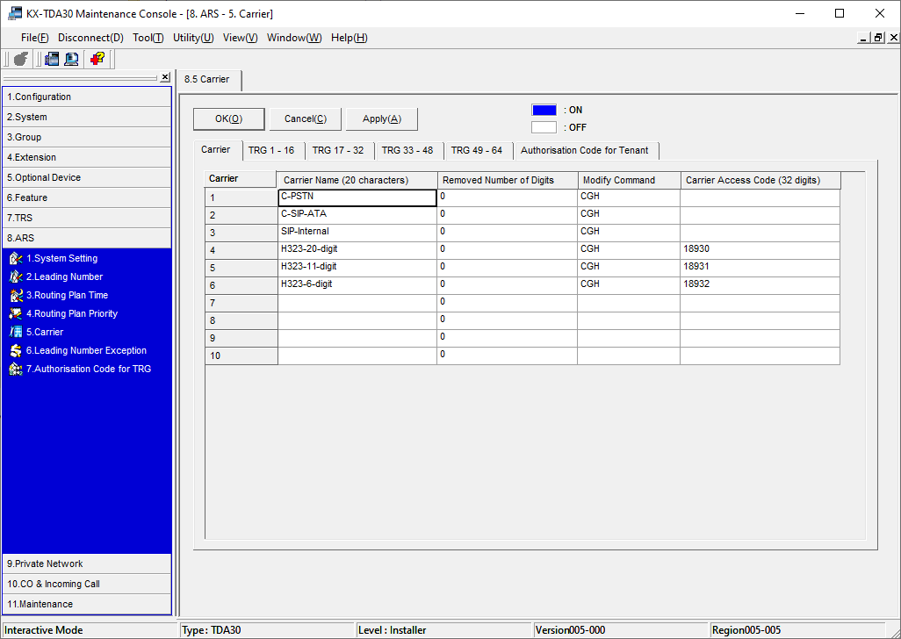
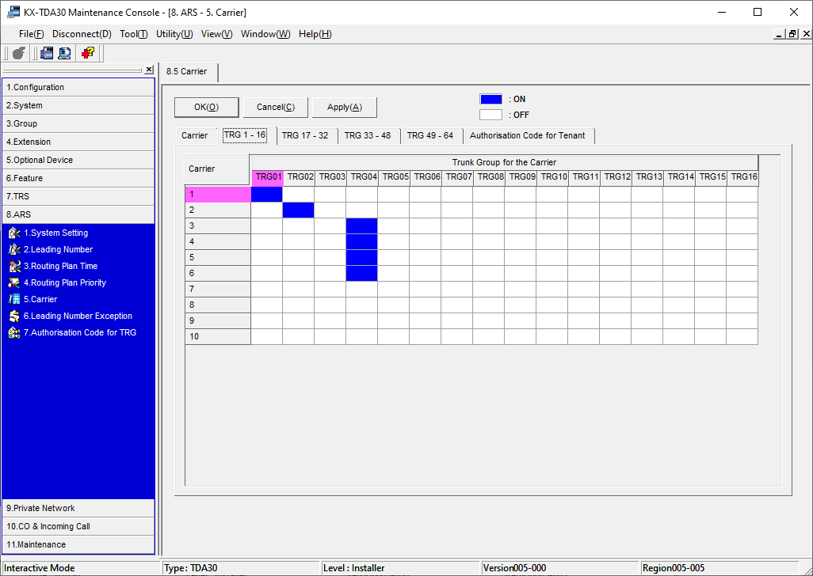
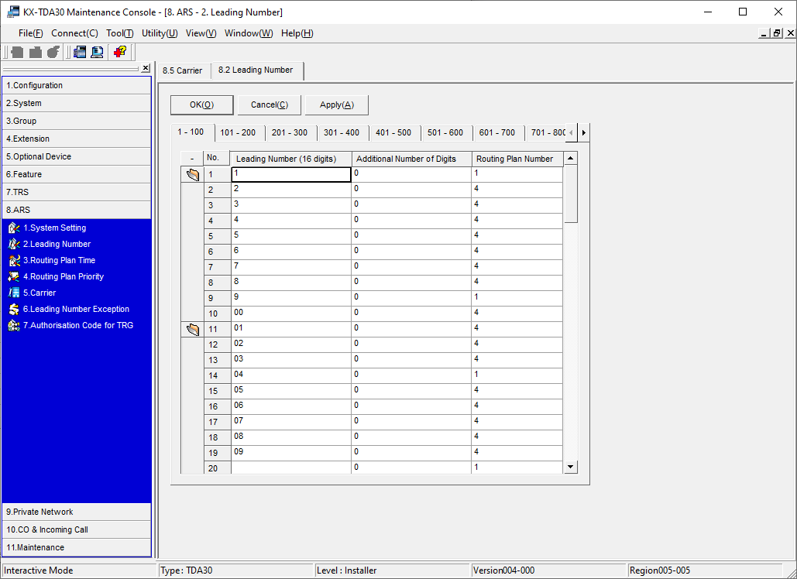
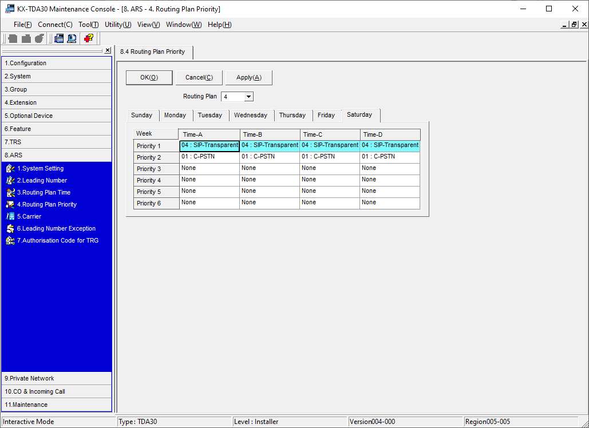
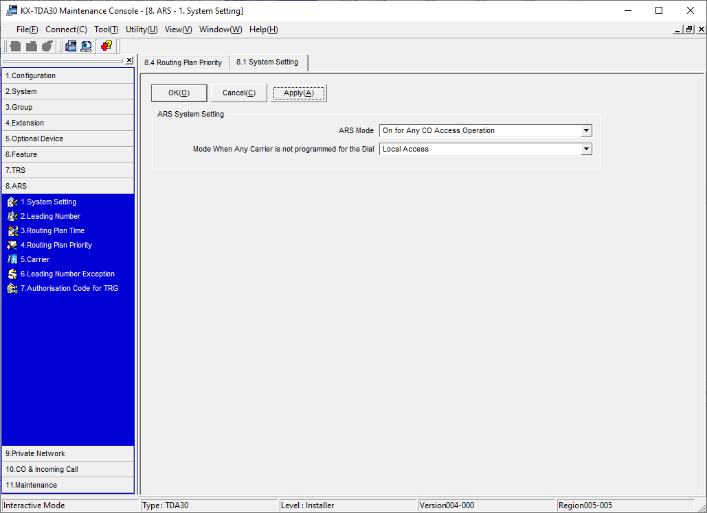

# ARS (Automatic Route Selection)

[Site Home](../README.md)

The Asterisk server is set up with a dial plan context, which allows access to the Asterisk extensions.

This causes an issue if the IPGW4 is intended to be also used as a CO line.  To overcome this problem, the ARS feature of the TDA30 is used to allow calls from Asterisk to break out into a different context, which simulates the behaviour of a single CO line, i.e. numbers dialled are all external PSTN numbers.

For the UK, Ofcom provides the [national-numbering-plan](https://www.ofcom.org.uk/__data/assets/pdf_file/0013/102613/national-numbering-plan.pdf) and [national numbering data](https://www.ofcom.org.uk/phones-telecoms-and-internet/information-for-industry/numbering/numbering-data).  IDA (indirect access) carrier access numbers are in the range 124-140, 143-146, 148-149, 160-169 and 181 to 189.

To avoid any conflict with an existing service code, should the call mistakenly escape to the PSTN via another CO line, we have chosen a range which is currently unused: 18930 to 18959.

## ARS on Asterisk

Within the Asterisk extension dialling context we place the line:

```
[sip_extensions]
exten => _18930X.,1,Goto(sip_uk_transparent,${EXTEN:5},1)
...
```

This could also be used to provide access to multiple SIP providers, e.g. by using 18931, 18932...

```
[globals]
LOCAL_STD=01632
...

[sip_uk_transparent]
exten => _0.,1,Dial(SIP/${EXTEN}@sipgate-proxy,360)
exten => _[2345678].,1,Dial(SIP/${LOCAL_STD}${EXTEN}@sipgate-proxy,360)
exten => 999,1,Dial(SIP/999@sipgate-proxy,10000)
...
```


This accepts dialled numbers prefixed with 18930, strips the first five digits, and redirects them to the context `sip_uk_transparent`.  This context behaves as if it is on the local PSTN, i.e. numbers in the range 2 to 8 are prefixed with the local area code.

### Exceptions
The national numbering plan prohibits local number dialling, without a code in the following regions.

| Code | Area |
|----|----|
| 01202 | Bournemouth |
| 01224 | Aberdeen |
| 01273 | Brighton |
| 01274 | Bradford |
| 01642 | Middlesbrough |
| 01908 | Milton Keynes |


## ARS on the TDA30

Set up the Carriers.  8.5 Carrier




Select the TRG1-6 tab and choose the correct carrier for each trunk group.  Apply.



Set up the leading numbers.  8.2 Leading Number

TODO - ERROR ON THIS SCREENSHOT - 2-8 should go to routing plan #3. 



8.4 Routing Plan Priority



8.1 System Setting

Enable ARS Mode



[Site Home](../README.md)

[Dial Plan](Dialplan.md)

[KX-TDA3480 IPGW4 Configuration](IPGW4.md)

[Home](README.md)

