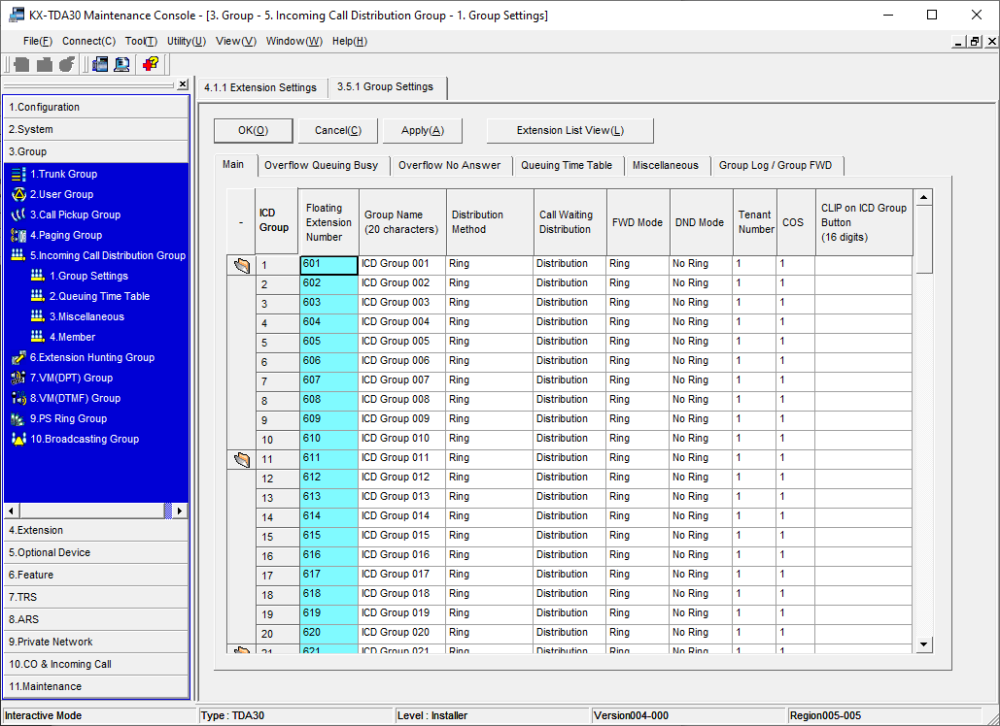

# Dial-plan / Numbering Plan

[Site Home](../README.md)

The choice of "Dial Plan" or "Numbering Plan" is possibly the most important decision process before attempting any further work.  Getting this wrong, will cause problems and pain, at a later date.

In this example:

| Leading Digits | Purpose                 | Asterisk | TDA30-A | TDA30-B |
| -------------- | ----------------------- | -------- | ------- | ------- |
| 0              | Operator                |          |         |         |
| 1xx.           | Special system numbers  |          |         |         |
| 2xx            | Extensions              |          | X       |         |
| 3xx            | Extensions              | X        |         |         |
| 4xx            | Extensions              |          |         | X       |
| 5xx            | Voicemail               |          | X       | X       |
| 6xx            | Ring/hunt Groups        | 660-699  | 600-629 | 630-659 |
| 7xx            | N/A                     |          |         |         |
| 8xx            | Trunk Access (specific) | X        | X       | X       |
| 9              | Trunk Access (general)  | X        | X       | X       |

##Programming the Dial Plan on the KX-TDA30
Decide on the number range for your extensions.  Renumber any spare extensions, so that they are all in that range.

If you want to groups in one range, across all devices, it will first be necessary to delete all Incoming call groups.  Delete all the ICD groups:

Apply, and then click "Extension List View".

You will see that in the 600 range, 600 and 699 remain.

Navgate to 5.2 - Optional device, and renumber the Pager extension to e.g. 498.

Navigate to 11.1 - Maintenance, and renumber the ISDN remote extension to e.g. 499.

Refresh the Extension List View, and the 600 range should now be empty.

Navigate to 2.6.1 - System, Numbering Plan, Main.  You may now remove unused ranges, e.g. 2XX and 6XX.

You may now re-add e.g. 63X, 64X and 65X.  Apply.

Click on the "Other PBX Extension" tab, and add the leading number ranges of Asterisk and your other TDA30 systems. e.g.

Return to Groups, Incoming Call Distrubution Group, and re-add the necessary groups required, along with a suitable name:

Note the group "PSTN to Asterisk".  This will be used to divert the PSTN into Asterisk, when Night or Break Service is selected.

Navigate to Trunk Groups, choose suitable names, and ensure that a suitable COS (Class of Service) is selected for each.

Navigate to 10.1 CO Line Settings, and select the appropriate Trunk Group Number for each line.  Choose a suitable name for each one.

Navigate to 10.2 DIL Table.  Choose an appropriate destination for each incoming call, e.g.

Navigate to 9.1 Private Network, TIE Table.

Enter the leading digits for other PBXs in the setup and choose the correct Trunk Group, e.g.

Own PBX code should be left blank.

[Site Home](../README.md)

[Automatic Route Selection](ARS.md)

[KX-TDA3480 IPGW4 Configuration](IPGW4.md)

[Home](README.md)

