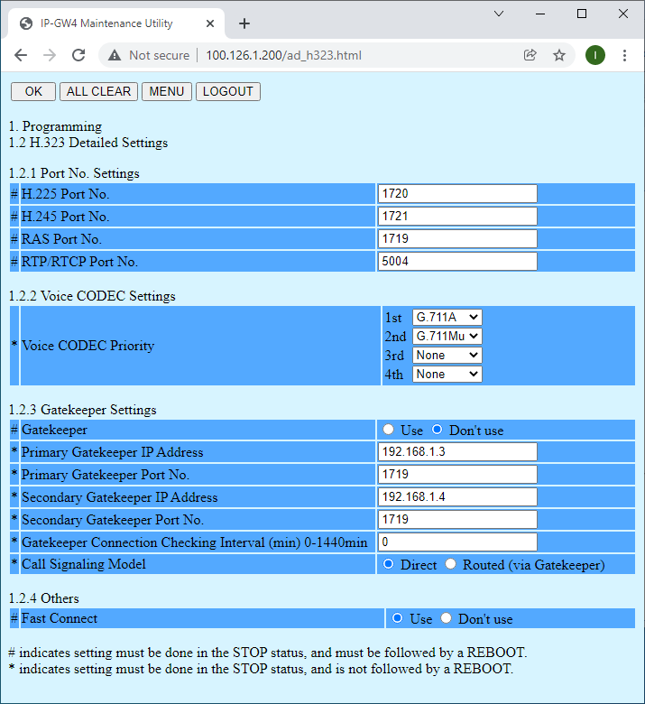
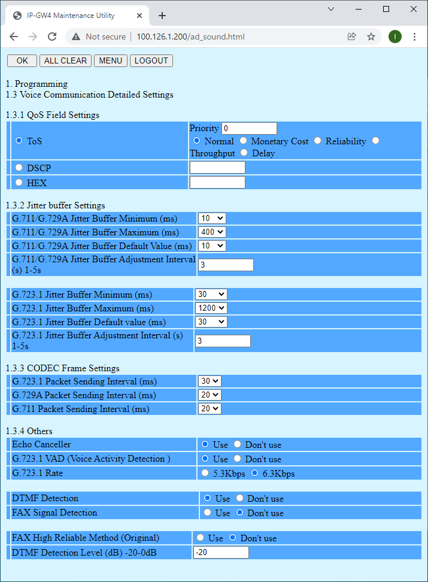
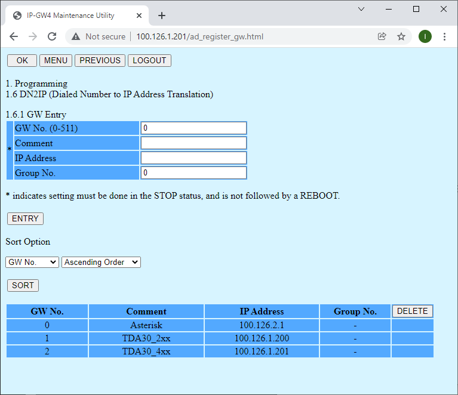
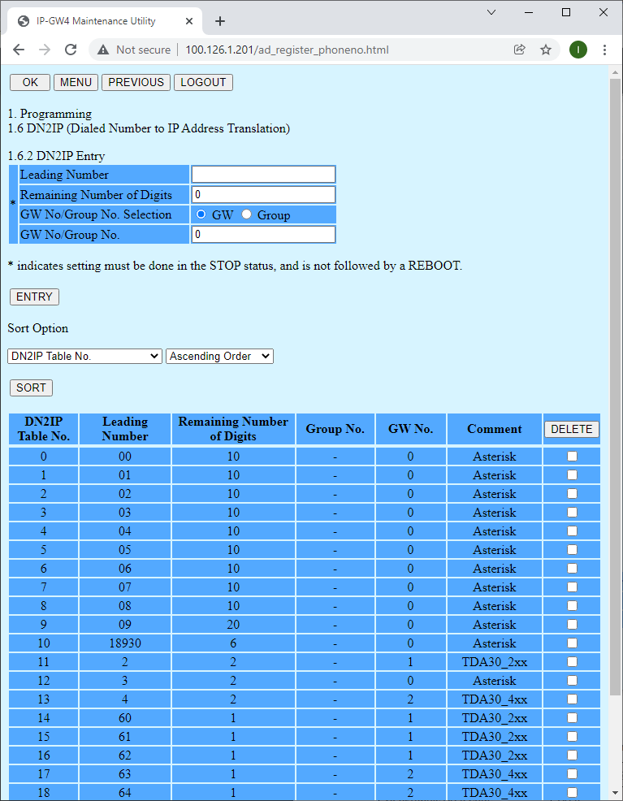

# KX-TDA3480 IPGW4 Configuration

[Site Home](../README.md)

The IPGW4 card provides h.323 communication for four channels to the KX-TDA15/30 PABX systems.  This may be interfaced with Asterisk using the ooh323 driver.

Extensive configuration information is provided in the manuals "4-Channel VoIP Gateway Card - Getting Started" and "4-Channel VoIP Gateway Card - Programming Guide".

If your card requires restoring to factory defaults, the reset procedure is described in "Getting Started" appendix C.

The IPGW4 allows remote configuration of the PBX, as well as the card, over TCP/IP (note that this requires PBX firmware 4 or later).

Once the card is reset to factory defaults, it has the following settings, to access it:

|  | Value |
|----|----|
| IP Address | 192.168.1.200 |
| Subnet Mask | 255.255.255.0 |
| Username | Administrator |
| Password | Administrator |

## Configuration Warning
DO NOT expose the IP address of the IPGW4 card to any public IP address.  If you were to, you would undoubtedly be attacked within minutes, and become a victim of "toll fraud".

The IPGW4 does not provide any IP security, not even for configuration.  If you plan to use these cards on multiple network segments, you MUST provide a privately routed secure network such as IPSEC tunnel or other VPN solution.  Avoid NAT if possible.  This solution has not been tested with NAT.

It is strongly suggested that if your Asterisk server is exposed on a public IP address, that the h.323 listener is bound to an internal IP address, which is not public.

## IP Address Configuration 

Choose 1.1 Network Settings, General and select an appropriate IP address, subnet and gateway settings.

1.2 



### 1.2.2 Voice CODEC Settings

For this example we shall use g.711 variants.  Your Asterisk installation is unlikely to support native g.729a unless you have licensed additional codecs.

In general, if you are in Europe, you should choose g.711a as the first priority codec.  If you are in the Americas you should choose g.711u.  You should enable them both though.  Disable all other codecs.  This applies to your Asterisk installation too.

  



### 1.4 VoIP Gateway/IP-PBX Interface Settings

Openreach specification SIN351 specifies loop disconnect interdigit timeouts.  You may wish  to reduce the Inter-digit time to perhaps 3 seconds.  This timeout is applied where line access to a IPGW4 CO has been used and a DN is shorter than the length specified in the table 1.6.2 (DN2IP).

## 1.6.1 DN2IP (Dialed Number to IP Address Translation) - GW Entry

Make an entry for each site in your setup.



## 1.6.2 DN2IP (Dialed Number to IP Address Translation) - Table

"Remaining Number of Digits" is not specific, but a maximum.  If the maximum number is not met, the inter-digit timeout specified in 1.4 will apply.

Note that this dialplan assumes that Asterisk's extension context recognises all numbers with a leading 0 to be on the PSTN.  The 18930 pseudo IDA code is specifically to address Local Area Code PSTN numbers not having a leading 0.

*UK specific note: Do not assume that all UK geographic numbers are 10 digits after the leading 0; they are not, e.g. 01404 41XXX.*



This table should be identical on all IPGW4 cards participating in the setup.  You may use "3.2 Download of Configuration data (VoIP Gateway -> PC)" to backup the table.  The file may be edited by hand, if there are a large number of changes to make.

Your Asterisk server will need to have a dialplan capable of making equivalent routing decisions, e.g.

```
[extensions]
exten => _2XX,1,Dial(ooh323/${EXTEN}@TDA30_2_out,120,Ttr)
exten => _4XX,1,Dial(ooh323/${EXTEN}@TDA30_4_out,120,Ttr)
exten => _6[0-2]X,1,Dial(ooh323/${EXTEN}@TDA30_2_out,120,Ttr)
exten => _6[3-5]X,1,Dial(ooh323/${EXTEN}@TDA30_4_out,120,Ttr)
```


---

[Dial plan](./Dialplan.md)

[Automatic Route Selection](./ARS.md) - Required for external Asterisk routing with the IPGW4 card.

[IPGW4 Configuration](./IPGW4.md) 

[Essential Terminology](./Terminology.md) 

[Wiring Notes](./WiringNotes.md) 

[Emergency Considerations](./OtherConsiderations.md) 

[Third Party Resources](../Third%20Party%20Resources/README.md) - Various specifications describing dialling, ringing and other signalling.


