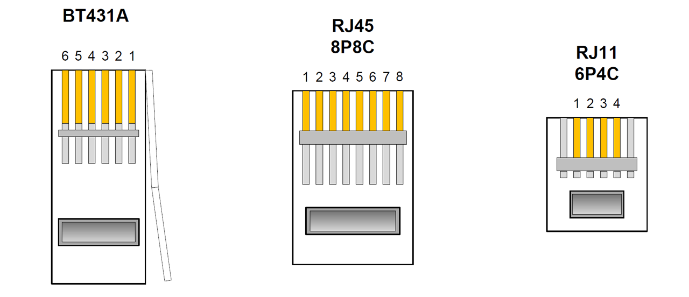

# Wiring Notes

[Site Home](../README.md)

It is important to follow this carefully, if you wish to retain consistent A (+ve) B (-ve) polarity throughout your installation.  Some say that polarity is not important, though some older equipment may experience problems if is not correct.  Polarity is very important for digital proprietary equipment.  Be cautious that Panasonic TDA RJ11 pins are reversed from RJ45.  Note also that CO connections are reversed from extensions.

### Panasonic TDA30 RJ45 (UK)

| RJ45 pin | RJ45 T568B colour | LCOT - RJ45 | DHLC4 - RJ45 | SLC - RJ45 | DLC - RJ45 |
| :------: | :---------------: | :---------: | :----------: | :--------: | :--------: |
|    1     |   Orange/White    |             |              |            |            |
|    2     |      Orange       |             |              |            |            |
|    3     |    Green/White    |             |   D2 - Low   |            |  D2 - Low  |
|    4     |       Blue        |   Tip - A   |   Ring - B   |  Ring - B  |            |
|    5     |    Blue/White     |  Ring - B   |   Tip - A    |  Tip - A   |            |
|    6     |       Green       |             |  D1 - High   |            | D1 - High  |
|    7     |    Brown/White    |             |              |            |            |
|    8     |       Brown       |             |              |            |            |

\* *Note that for Panasonic LCOT, DHLC (built in), SLC and DLC cards with RJ11 connectors, the wiring is reversed.*

### Panasonic TDA30 RJ11 (Some other regions)

| RJ11 pin | RJ11 colour | RJ11 colour (alternate) | LCOT - RJ11 | DHLC4 - RJ11 | SLC - RJ11 | DLC - RJ11 |
| :------: | :---------: | :---------------------: | :---------: | :----------: | :--------: | :--------: |
|    1     |    Black    |          White          |             |  D1 - High   |            | D1 - High  |
|    2     |     Red     |          Green          |  Ring - B   |   Tip - A    |  Tip - A   |            |
|    3     |    Green    |          Blue           |   Tip - A   |   Ring - B   |  Ring - B  |            |
|    4     |   Yellow    |           Red           |             |   D2 - Low   |            |  D2 - Low  |

### BT 431A

#### Caution
UK telephone plugs style 431A are not a direct pass-through from RJ11 plugs on CW1311 (RJ11 cable).  Many other regions use the centre pair for A and B.  UK wiring uses the next pair out.  This means that RJ11 colours will not correspond to the table above.

Note that there is some disagreement about pin numbers, depending on which specification you read.  These match the diagram above and the numbers in the corresponding wall socket.

| Pin  | Openreach Purpose | TDA30 Purpose | CW1308 colour | CW1311 colour | RJ11-6P6C (DLC) colour |
| :--: | :---------------: | :-----------: | :-----------: | :-----------: | :--------------------: |
|  1   |        N/A        |    DLC D2     |     Green     |      N/A      |         Orange         |
|  2   |         B         |     SLC B     |     Blue      |    Yellow     |          Red           |
|  3   |       Bell        |      N/A      |    Orange     |     Green     |          Blue          |
|  4   | N/A or PBX earth  |      N/A      | Orange/White  |      Red      |         Green          |
|  5   |         A         |     SLC A     |  Blue/White   |     Black     |         White          |
|  6   |        N/A        |    DLC D1     |  Green/White  |      N/A      |         Black          |

See also [https://telephonesuk.org.uk/wiring-info/](https://telephonesuk.org.uk/wiring-info/)

---

[Dial plan](./Dialplan.md)

[Automatic Route Selection](./ARS.md) - Required for external Asterisk routing with the IPGW4 card.

[IPGW4 Configuration](./IPGW4.md) 

[Essential Terminology](./Terminology.md) 

[Wiring Notes](./WiringNotes.md) 

[Emergency Considerations](./OtherConsiderations.md) 

[Third Party Resources](../Third%20Party%20Resources/README.md) - Various specifications describing dialling, ringing and other signalling.

